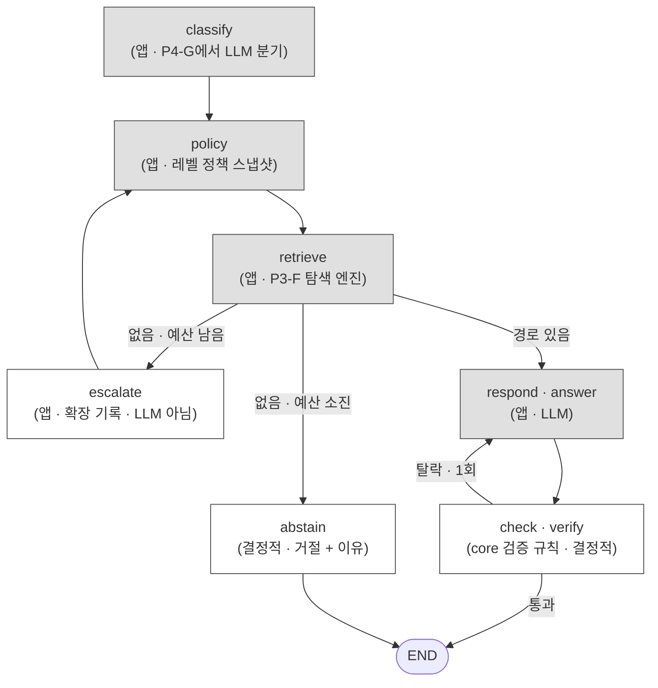

# REPORT — 내 Steam 라이브러리로 만드는 지식 그래프 에이전트

> 상태: 70% 초안. 측정 결과(3절)와 데모(5절)는 파이프라인 완성 후(P4-H)에 채운다.
> 이 문서는 아이펠 「지식 그래프 에이전트 만들기」 과제 제출물이면서, 그대로 오픈소스 저장소의 문서다.
> 판단 기준은 "제3자가 받아서 쓸 수 있는가"다. 결정의 이유와 포기한 것을 함께 적는다.

> **2026-09-21 릴리즈 정정 (현행):** 현재 공개 demo는 실존 Steam 게임 50건의 공개 메타데이터 코퍼스 위에서 동작한다. `questail collie serve --demo`가 임시 corpus·graph를 만들어 서빙하며 캐시·Steam 계정·개인 라이브러리를 읽지 않는다. UI·CLI는 실제 `/ask` SSE를 호출하고, 선택 경로와 원문 근거 span은 항상 표시한다. 생성 답변 문장은 서버에 LLM 키가 있을 때만 나오고(키는 요청 키 > `process.env` > 실행 디렉터리 `.env` > 사용자 설정 순으로 읽는다), 키가 없으면 경로와 원문 근거만 반환한다. 생성 프롬프트에는 그래프 간선 타입이 주입되어 선택 경로의 관계를 바꿔 말하지 못하게 하며, 간선 타입 전달이 빠지면 실패하는 회귀 테스트로 고정했다. `check` 검증 규칙·core agent 도구 실행·개인 real 코퍼스 질의는 이번 공개 demo 범위가 아니다. 검색 동작은 태그 공유 폴백 도입 이후가 현행이다. 정상 선정(경로에 태그가 아닌 간선 최소 1개)이 전 레벨에서 실패하고 L0 후보가 전부 태그 전용일 때만 태그 공유 폴백으로 답하며, 브리지 태그는 문서 빈도(df) 합이 가장 작은 희소 태그를 우선한다. 폴백 여부는 trace의 relaxationReason에 tag-fallback 마커로 남고, 화면은 폴백일 때만 태그 공유임을 한 줄로 밝힌다(정상 경로에는 뜨지 않는다). 폴백 도입 후 50게임 전부 답하나(보류 0건), 그중 24게임 120문항의 답은 태그 공유 근거이며 개발사·퍼블리셔 관계처럼 확정적인 연결이 아니다. 기존 26게임 130건은 경로·근거·레벨·사유까지 바이트 동일하다(회귀 0건). 전수 실측 수치는 `SUBMISSION.md` 알려진 한계를 보라. 각 절이 어느 코퍼스의 기록인지는 아래 표를 보고 읽어라.
>
> | 절 | 기준 코퍼스 | 현행 여부 | 대신 볼 문서 |
> |---|---|---|---|
> | 1. 주제와 코퍼스 | 개인 라이브러리 + 보강 126건(2026-09-21 실측) | 옛 기록. 현 데모 코퍼스가 아님 | `SUBMISSION.md` 데이터 출처와 경계 |
> | 2. 골든셋과 스키마 | 합성 `Lumen Reach` 50건 + 골든셋 21건(정답 12·함정 9) | 옛 기록. 현 골든셋은 `demo-corpus/relations.gold.json` 20건(정답 11·함정 9) | `packages/collie/README.md` 데이터 |
> | 3. 관계 추출 게이트 | 합성 + 126건 real | 옛 실험 기록. "demo precision" 열도 현 데모가 아님 | 없음. 기록으로만 읽을 것 |
> | 4. 측정 결과 | 126건 real, 평가 11문항(Q01~Q11) | 옛 실험 기록. 등장 게임이 현 코퍼스에 없으며, Q10 판정(실패가 정답)은 현 데모와 반대다 | `SUBMISSION.md` 알려진 한계(250문항 전수 실측) |
> | 5. 파이프라인 구조도 | 구조 설명(특정 코퍼스 아님) | 혼합. 완화 축 수치표·끊김 판정은 태그 폴백 도입 이전 기준이다. 폴백은 사다리(L0~L4) 밖에 별도로 존재한다(L0 후보 전부 태그 전용일 때만 희소 태그 우선 선정). "retrieve 스텁" 서술은 옛 상태다 | `src/retrieve/engine.ts`·`src/retrieve/select.ts`, 폴백 실측은 `SUBMISSION.md` 알려진 한계 |
> | 6. 데모 설계 | 126건 real 시절 화면(평가셋 모달·단일 `index.html`) | 옛 기록. 모달 제거·다중 파일·2열 탭이 현행이다 | `packages/collie/README.md` 화면 |
> | 7. 프로젝트 회고 | 1~6절 작업 과정 | 회고 기록으로 유효. 단 df 56/34/34/33 등 분포 수치는 126건 기준이다 | 수치의 현행 대응은 `SUBMISSION.md` 알려진 한계 |

## 1. 주제와 코퍼스

> **이 문서에 나오는 게임 제목은 저자 개인 Steam 라이브러리의 실제 보유 목록이다.** 코퍼스가 공개 데이터셋이 아니라 한 사람의 라이브러리라는 점이 이 프로젝트의 전제이므로 제목을 가명으로 바꾸지 않았다. 측정 경로와 골든셋이 실제 데이터에서 나왔다는 것을 확인할 수 있어야 하기 때문이다. 플레이타임·별점·주관 노트 등 보유 사실 외의 개인 데이터는 이 문서에 싣지 않았고, 원본 노트(`games/`)는 저장소에 포함되지 않는다.


### 왜 Steam 라이브러리인가

두 목표가 하나의 작업으로 닫힌다. 아이펠 실습 과제가 요구하는 "50건 이상 문서 → 지식 그래프 → 멀티홉 질의응답" 구조와,
questail M2.5b가 이미 예약해둔 앱 계층 자리가 같은 모양이다. 내 Steam 라이브러리는 이미 수집된 실측 데이터
(`.cache/appdetails` v2 raw 119건 + SteamSpy 태그 101건)가 있었고, questail 본체의 에이전트 계층(도구 9종·결정적 라우터)은
동작하는 제품 없이 부품만 있던 상태라 그래프 탐색이 "열 번째 도구"로 얹히는 자리가 비어 있었다.

### 위키백과 대안을 왜 탈락시켰는가

과제 명세가 전제하는 수집 프롬프트는 한국어 위키 기준이다. 영어 Steam 본문에 그 기준을 1:1로 옮길 근거가 없어 탈락시켰다.
같은 이유로 길이 기준 800자도 값만 빌려오고 단위와 분포는 실측으로 재확인했다(2절·SPEC의 분포표 참조).
출처: 착수 전 실측(2026-09-21), 코퍼스 119건 기준.

| 축 | Steam appdetails + SteamSpy | 한국어 위키백과 |
|---|---|---|
| 개발사·퍼블리셔·출시일·장르·플랫폼 | 퍼블리셔가 직접 입력한 1차 출처 | 2차 편집물, 누락·지연 |
| 유저 태그 | 고유 199종, 중간대(df 3~15) 82개 | 대응물 없음 |
| 시리즈·전작·계보 | 필드 자체가 없음. 42개 키 전수 확인. 본문에 자연어로만 | infobox·분류에 구조화 |
| 커버리지 통제 | 보유 라이브러리로 고정, 시리즈 중복 24% | 시리즈당 3~6개 의도적 선정 가능 |

탈락 근거는 세 줄이다. 첫째, 과제 성격이 "내 도메인에서 배운 것을 녹인다"인데 캡틴 도메인은 Steam 라이브러리이지 위키가 아니다.
둘째, 위키로 가면 SteamSpy 태그 축(유일한 밀집 브릿지)과 1차 메타데이터를 통째로 버린다.
셋째, 시리즈 관계가 없다는 약점은 본문 LLM 추출로 메울 수 있고,
그게 오히려 과제 2단계가 요구하는 "흩어진 문서에서 관계를 뽑아"에 정확히 해당한다.
위키안은 Steam 접근·추출이 불가하거나 사전 게이트가 실패할 때의 폴백으로만 남겼다.

### 126건을 어떻게 모았는가

- 기존 `.cache/appdetails` v2 raw **119건** + SteamSpy 태그 101건. 기존 캐시는 읽기 전용으로 두고 손대지 않았다.
- **보강 7건**을 `.cache/graph-corpus/`에 따로 모아 코퍼스 **126건**. 보강의 목적은 게이트 수치였다(아래 표).
- 캐시 파일 184건과 라이브러리 120건의 갭 64건은 legacy 59건 + 키워드형 5건과 정확히 일치한다. 미스터리가 아니다.

| 게이트 (DEV 강제 기준) | 보강 전(119) | 보강 후(126) | 판정 |
|---|---|---|---|
| 최대 연결성분 | 91.6% | 92.1% | 통과 |
| 브릿지 참여 | 91.6% | 92.1% | 통과 |
| 시리즈 참여율 | 28.6% | 34.1% | 통과 |
| gold path 시작 게임 | 108 | 115 (경로 5,728) | 통과 |
| 유효 시리즈 3게임+ | 2 | 4 | 게이트 폐기 |

유효 시리즈 15개 게이트는 폐기했다. 과제 요구가 아니라 우리가 만든 것이고, 시리즈가 맡을 멀티홉 브릿지는
개발사 축이 이미 하고 있으며, 남은 부족분은 구조적으로 불가능하다
(Darkest Dungeon·Slay the Spire는 3호가 없고 Alan Wake 2는 Steam 미출시).

### 보강 7건의 선정·탈락 기준

출처: `.cache/graph-corpus/manifest.json`. 선정 원칙은 하나다. 코퍼스에 이미 있는 개발사·시리즈와 겹치는 게임을 보강해
DEV 강제 gold path의 재료를 늘린다. 신규 개발사는 Hades 1건만 예외로 두었다.

| appid | 게임 | 선정 사유 | 유효 태그 | 시리즈 근거 |
|---|---|---|---|---|
| 397540 | Borderlands 3 | Gearbox 겹침, BL 시리즈 3호 | FPS, Looter Shooter | Borderlands 4·2 (base 동일) |
| 631510 | Devil May Cry HD Collection | Capcom 겹침, DMC 시리즈 4호 | Character Action Game, Classic, Difficult, Great Soundtrack, Hack and Slash, Spectacle fighter | DMC 4 SE·DMC 5 (LCP3) |
| 373420 | Divinity: Original Sin EE | Larian 겹침, dev 2→3, DOS 시리즈 2호 | Character Customization, Fantasy, Strategy, Turn-Based, Turn-Based Combat | DOS 2 DE (base 동일) |
| 1962700 | Subnautica 2 | UW 겹침, Subnautica 시리즈 3호 | 없음 — SteamSpy 태그 미보유 | Subnautica·Below Zero (base 동일). 본문에 Below Zero 언급이 있어 태그로 못 붙는 게임을 본문 관계가 구해낸 사례 |
| 1601580 | Frostpunk 2 | 11bit 겹침, dev 3→4 | Management, Post-apocalyptic, Resource Management, Steampunk, Strategy | Frostpunk (base 동일) |
| 1145350 | Hades II | Hades 시리즈 2호 (신규 dev) | Action RPG, Action Roguelike, Dungeon Crawler, Hack and Slash, Isometric, Rogue-like, Rogue-lite | Hades (base 동일) |
| 952060 | Resident Evil 3 | Capcom 겹침, RE 시리즈 4호 (리메이크 우선) | Female Protagonist, Survival Horror, Zombies | RE 2·4·6 (base 동일) |

탈락 4건의 사유는 셋으로 갈린다.

| 후보 | 사유 | 분류 |
|---|---|---|
| Oxygen Not Included (457140) | 코퍼스 중복. 이미 v2 영문·태그 보유, Klei df 기여 없음 | 코퍼스 중복 |
| The Witcher 2 (20920) | 코퍼스 중복. 이미 v2 영문 보유 | 코퍼스 중복 |
| Beat Saber DLC (3274290, Alan Wake 2를 찾았더니 나온 결과) | type=dlc | DLC |
| Alan Wake 2 (appid 없음) | Steam 미출시(Epic 전용). storesearch에 실물 없음 | Steam 미출시 — 구조적 보강 불가 |

일반적으로도 DLC는 축으로 쓸 수 없다. `dlc` 키 보유가 88/119건인데 참조 815건 중 코퍼스 안에 존재하는 것이 0건이라서,
DLC를 다리로 쓰면 바깥으로만 나가고 돌아오지 않는다.

마지막 건이 중요하다. "시리즈 유효 그룹 15개" 게이트를 폐기한 이유가 바로 이것이다.
더 수집해서 되는 문제가 아니라 실존 시리즈가 고갈됐다.
Darkest Dungeon·Slay the Spire는 3호가 없고, Don't Starve는 standalone 3호가 없다.

## 2. 골든셋과 스키마

### 삼중항 기준

삼중항은 `(주어, 관계, 목적어)` 한 칸짜리 사실이다. 인정 조건은 넷이다.

1. 타입이 목록에 있을 것. `same_series` 같은 변형 표기는 거부한다.
2. 방향이 규칙대로일 것. `SEQUEL_OF`는 항상 후속작이 주어, `SAME_UNIVERSE`는 appid 오름차순이다.
3. 원문 span이 있을 것. LLM 추출 관계는 근거 문장이 해당 문서 본문의 정확한 substring이어야 한다.
4. 양쪽이 코퍼스 안에 있을 것. 바깥 게임을 가리키면 간선을 만들지 않는다.

근거 문서와 주어는 다를 수 있다. 역방향 진술(900008 본문이 "...years before Lumen Reach 7"이라 쓰면
간선은 `900007 —[SEQUEL_OF]→ 900008`이지만 근거는 900008 문서)이 있어서 모든 삼중항에 `evidenceDocument`를 따로 둔다.

### 결정적 추출과 LLM 추출의 경계

| 관계 | 출처 | 방식 |
|---|---|---|
| `HAS_TAG` (votes·rank 보유) | SteamSpy 응답 | 결정적. LLM을 쓰지 않는다 |
| `DEVELOPED_BY` | Steam appdetails | 결정적 |
| `PUBLISHED_BY` | Steam appdetails | 결정적 |
| `IN_SERIES` (`GAME → SERIES`) | `about_the_game` 본문 | LLM + span 검증 통과분만 |
| `SEQUEL_OF` (후속작 → 전작) | 본문 | LLM + span 검증 통과분만 |
| `SAME_UNIVERSE` (appid 오름차순) | 본문 | LLM + span 검증 통과분만 |

LLM 프롬프트에는 본문 원문만 넣고 **frontmatter를 넣지 않는다.**
넣으면 우리가 방금 써넣은 속성을 LLM이 되읽고 "본문에서 추출했다"고 보고하는 자기참조가 된다.
게임 1건 = 문서 1건이라는 경계는 이 한 문장으로 지킨다. 본문에 속성을 풀어쓰는 렌더 문장도 추가하지 않는다.

### 뽑지 않기로 한 관계와 그 대가

장르·플랫폼·`categories`는 속성이지 확장 간선이 아니다. `가족 공유`가 113건(94%)이라 다리로 쓰면 아무 데나 연결된다.
대가는 연결성 손실이 아니라 평가의 엄격함이다. 태그는 edge로 유지하되(연결성 92.1%의 재료),
평가 경로(gold path)에서는 `DEVELOPED_BY`를 최소 1개 강제한다. 아래 "의사 멀티홉 배제" 참조.

### 골든셋 21건의 설계 의도

공개 합성 demo 코퍼스 50건(`Lumen Reach 1~50`, appid 900001~900050)에 심은 정답 12건과 함정 9건이다.
전 항목의 근거 문장이 해당 문서 본문의 실제 substring임은 독립 검증했고 불일치 0건이다.
기존 eval 목데이터 171건은 개발사·퍼블리셔·출시일·본문·태그가 없어 그래프 입력이 안 되므로 새로 만들었다.
`26/27` 픽스처는 건드리지 않는다.

정답 12건 중 3건(T5·T6·T7)은 문자열 일치로 절대 안 잡히고 LLM만 잡는다. 이 3건이 골든셋의 값이다.

- **T5 역방향** — 문장은 Lumen Reach 8에 있는데 간선의 주어는 Lumen Reach 7이다.
  "(8은) 7보다 몇 해 전"이므로 속편은 7이다. `evidenceDocument` 분리가 여기서 강제된다.
- **T6 대명사** — "같은 승무원으로 그것을 이어간다". 목적어가 대명사다.
- **T7 제목 없음** — "그 해도가 지금도 이 원정을 이끈다". 상대 게임 제목이 문장에 아예 없다.

함정 9건은 거절이 정답이다. 올바른 추출기는 함정을 아예 내놓지 않으므로,
정답 표본만으로는 "관계처럼 보이는 언급을 무조건 내놓는" 관대한 추출기가 드러나지 않기 때문이다.
F8·F9는 같은 고유명사가 시리즈일 때와 아닐 때를 가른다.
`Aurora Cycle`이 정답 항목에서는 진짜 시리즈인데, F8에서는 작중 책 제목이고 F9에서는 축제 이름이다.
이름만 보고 판단하면 걸린다.

`demo-corpus/relations.gold.json` 전문(정답 12 · 함정 9, fingerprint `1bc2a7bd…`)과
`manifest.json`(50건, 본문 fingerprint·문자 수 포함)이Initialize 저장소에 커밋되어 있다. 재현은 이 둘에서 시작한다.
현행 포인터: 현 골든셋은 `demo-corpus/relations.gold.json` 20건(정답 11·함정 9)이며, 위 fingerprint·건수는 교체 전 합성 코퍼스 기준이다.

### 품질 게이트와 폴백

게이트가 둘이다. 섞으면 안 된다.

| 게이트 | 무엇을 재나 | 통과선 |
|---|---|---|
| emitted 품질 | 실제 추출 결과에서 seed 고정 30건 표본(미만이면 전수) | span 귀속 100% · 사람 라벨 precision 0.8 이상 |
| demo challenge | 골든셋 21건 전수 | positive recall(12건 중) · negative false-positive rate(9건 중) |

미달이면 관계 간선을 평가 경로에서 빼고 결정적 속성 그래프(`TAG`+`DEV`+`PUB`)로 폴백한다.
gold path의 `DEVELOPED_BY` 조건은 폴백 후에도 유지된다.

## 3. 관계 추출 게이트 — 측정 이력

본문에서 `IN_SERIES`·`SEQUEL_OF`·`SAME_UNIVERSE`를 LLM으로 뽑고 원문 span으로 검증했다. 게이트 둘을 두었고 emitted precision은 **사람이 라벨링**했다 — span 검증은 "문장이 본문에 있는가"만 보고 "그 문장이 관계를 뒷받침하는가"는 보지 않기 때문이다.

> 아래 산출물은 `output/`(gitignore) 아래에 생성되며 저장소에 커밋하지 않는다. 재현은 `questail collie build`로 한다.
현행 포인터: 현 데모 그래프 실측 기준은 문서 50건·노드 111·간선 344(HAS_TAG 288·PUBLISHED_BY 30·DEVELOPED_BY 26)이다.

| 회차 | 모델 | 무엇을 바꿨나 | demo precision | demo recall | real precision | real 수율 |
|---|---|---|---|---|---|---|
| 1차 | gpt-4o-mini | 기준선. LLM이 appid를 직접 출력 | — | **0.167** | 0.375(합산) | — |
| 2차 | gpt-4o-mini | **appid 매핑을 코드로** · span 프롬프트 강화 | **0.846** | **0.917** | **0.22** | 정답 2 / accepted 9 |
| 3차 | gpt-4o | 상위 모델 · 추론 금지 프롬프트 + 반례 5종 | **0.889** | 0.667 | **0.60** | 정답 3 / accepted 5 |

통과선은 precision 0.8 · recall 0.6이다.

### 1차 → 2차 — 설계 결함이었다

1차 실패는 모델이 아니라 **LLM에게 appid를 직접 내게 한 설계**였다. `900013`을 `900024`로, `900039`를 `900038`로 냈다. 숫자를 정확히 옮기는 것은 LLM이 제일 못하는 일이다.

**LLM은 제목 문자열만 내고 appid 매핑은 코드가 하도록 고치자 recall이 0.167에서 0.917로 올랐다. 모델은 바꾸지 않았다.** 상위 모델을 먼저 시도했으면 비용은 쓰고 원인은 못 찾았을 것이다.

### 2차 → 3차 — 모델을 올려도 real은 안 됐다

2차 real 오답 7건이 전부 같은 패턴이었다.

```
"Frostpunk 2 elevates the city-survival genre to a new level."   → SEQUEL_OF 냄
"The original shooter-looter returns, packing bazillions..."      → SEQUEL_OF 냄
"Embark on your quest to Slay the Spire as..."                    → SEQUEL_OF 냄
```

**Steam 마케팅 카피는 관계를 서술하지 않는다. 제목의 숫자가 말한다.** 모델이 제목에서 유추하고 아무 문장에나 span을 붙였다. 세 번째 사례는 span이 `Slay the Spire`인데 그것은 제목이 아니라 동사구(`quest to slay the spire`)다 — 일반명사 충돌이 실데이터에서 나왔다.

정답이었던 2건은 본문이 실제로 관계를 말한다.

```
"Below Zero extends the story... introduced in the original game."   ✅
"The first-ever sequel from Supergiant... builds on the original."   ✅
```

상위 모델(3차)은 precision을 0.22에서 0.60으로 올렸지만 **수율이 무너졌다** — accepted 9건에서 5건으로 줄었고, 그중 서로 다른 삼중항은 2개뿐이다. **문서 113건에서 관계 2개다.** precision을 올려도 그래프에 기여하지 못한다.

같은 추출기가 관계를 명시한 합성 문서에서는 0.889를 낸다. **따라서 이것은 모델의 한계가 아니라 코퍼스의 성질이다.** 실패 층 분류에서 **색인(코퍼스) 층**에 귀속된다.

> 3차에서 모델과 프롬프트를 동시에 바꿔 둘의 기여를 분리하지 못했다. 추가 실행으로 분리하지 않았다 — 결론(코퍼스 성질)이 두 구성에서 같아 결정이 바뀌지 않기 때문이다. 다만 demo recall이 0.917에서 0.667로 **떨어진 것**은 기록해둔다. 추론 금지 지시를 강화한 프롬프트가 과도하게 보수적이었을 가능성이 있다.

### 부수적으로 드러난 것 — 리메이크 오선택

3차에서 `Dead Space 2`(2011)의 전작을 `Dead Space`(appid 1693980, **2023 리메이크**)로 지목했다. 정답은 `Dead Space (2008)`(17470)이다. 원작은 제목에 연도가 붙어 있어 정확일치에서 밀렸다.

모델 문제가 아니라 **개체 해소 문제**다. 출시일로 방향을 정하면 결정적으로 풀린다 — 속편은 언제나 더 이른 쪽을 가리킨다.

### 결론 — real은 제목 기반 결정적 추출로 간다

폐기하지 않고 방법을 바꿨다. **제목은 Steam이 붙인 원천 데이터이지 우리가 써넣은 파생값이 아니다.** 자기참조는 이미 결정적으로 갖고 있는 값(개발사·태그)을 본문에 렌더해 넣고 다시 뽑는 것을 말한다. 시리즈를 제목에서 얻는 것은 순환이 아니다.

**실측 결과**

| | 건수 |
|---|---|
| 제목 + 출시일 결정적 추출 | **`IN_SERIES` 27 + `SEQUEL_OF` 10 = 37건** (11그룹 / 27게임) |
| 본문 LLM 추출 | 2건 |

**18배다.** 그리고 재현 가능하고 LLM 비용이 0이다.

규칙은 `seriesKey`(정규화 → 상표기호 제거 → 괄호 제거 → 후행 edition 제거 → 후행 숫자 제거 → 관사 제거, **완전일치만**) + 실측 검증 목록 11키만 채택이다. **자동 접두 매칭을 쓰지 않았다** — 개발사 별칭에서 얻은 교훈과 같다. 과병합 0건이고, `Dead Cells` 단독 유지 · `Alan Wake`/`American Nightmare` 분리 · `Don't Starve`/`Together` 분리로 오탐 방지를 확인했다.

**출시일이 방향과 리메이크를 동시에 푼다.** 속편은 언제나 더 이른 쪽을 가리킨다. 3차에서 나왔던 오선택이 여기서 교정된다.

```
Dead Space 2 (2011) → Dead Space (2008, appid 17470)
                      2023 리메이크(1693980) 제외
Resident Evil 4r → 3r → 2r     리메이크 체인도 출시 순으로
```

역할을 재배치했다.

| 관계 | 출처 | 방식 |
|---|---|---|
| 개발사·퍼블리셔·태그 | frontmatter | 결정적 |
| **시리즈·속편** | **제목 + 출시일** | **결정적** |
| 세계관 공유·스핀오프 | 본문 | LLM 보조 (수율 낮음을 알고 씀) |
| demo 코퍼스 | 본문 | LLM — 과제 2단계 시연 (precision 0.889) |

### 이번 범위에서는 뺐다 — 별도 구현 계획으로 분리

추출까지가 이번 작업이고, **`graph.v1`에는 편입하지 않았다.** 정본 그래프에 `IN_SERIES`·`SEQUEL_OF`는 0건이고, **시리즈 편입은 별도 구현 계획으로 분리해 추후 구현한다.**

품질 때문이 아니라 범위 때문이다. 편입하면 정본 수치가 전부 움직여(L2 18,113 → 21,884 · L3 665,979 → 821,835) 완료 조건과 이 문서의 근거를 다시 써야 한다.

편입했을 때의 값은 정본과 같은 코드로 미리 재뒀다. 정본은 불변으로 두고 병합본을 따로 만들어 대조한 결과다.

| | 정본 (이번 범위) | 편입 시 |
|---|---|---|
| 연결성 · 브릿지 | 116 / 92.1% | 동일 |
| starts | 115 | 동일 |
| L2 경로 | 18,113 | 21,884 (+3,771, 전량 series 경유) |
| L3 경로 | 665,979 | 821,835 (+155,856) |

**연결성이 움직이지 않는다는 것이 핵심이다.** 시리즈는 이미 이어진 그래프에 지름길을 놓을 뿐 고립 노드 10건을 구하지 못한다. 도달 범위가 아니라 **경로의 질**을 바꾸는 간선이라, 나중에 붙여도 기존 측정이 무효가 되지 않는다.

그룹 멤버 수 분포는 `{2: 8, 3: 3, 4: 1}`로 최대 4다. 허브가 될 수 없는 크기라 편입 시에도 df 규정 없이 L0부터 열면 된다.

**대가는 Q07이다.** 평가셋의 유일한 L2 문항("서브노티카 후속작 갖고 있어?")이 `SEQUEL_OF` 없이는 성립하지 않는다. 실측 결과는 4절에 그대로 남긴다.

**외부 메타 DB(IGDB·Wikidata)는 검토하지 않았다.** 시리즈를 이유로 외부 의존을 들일 근거가 사라졌기 때문이다. 향후 확장은 외부 메타가 아니라 **Steam API로 미보유 게임을 후보 풀에 넣는 방향**이다(7절 회고 참조).

## 4. 측정 결과

### 1차 실측 — 배선 결함을 드러냈다

평가 11문항(Q12 미확정 제외)을 정본 그래프로 돌린 첫 결과다. **게임 시작 개체 해소 0건, 11문항 전부 abstain.**

| 문항 | 질의 속 표기 | 해소된 노드 | 결과 |
|---|---|---|---|
| Q01 | 몬헌 | (없음) | 실패 |
| Q02 | 보더랜드 | `tag:fps`만 | 게임 0건 |
| Q03 · Q07 | 서브노티카 | (없음) | 실패 |
| Q04 | 발더스게이트 | (없음) | 실패 |
| Q05 · Q09 | 하데스 · 다키스트던전 | (없음) | 실패 |
| Q06 | 바이오쇼크 · 위쳐 | `tag:fps`만 | 게임 0건 |
| Q08 | 시스템쇼크 | (없음) | 실패 |
| Q10 | 엘든 링 | (없음) | **실패가 정답** |
| Q11 | 알란 웨이크 | (없음) | 실패 |

Q02·Q06이 잡은 것은 질문 끝의 태그 필터(`FPS`)이지 시작 개체가 아니다. 실질 해소는 0이다.

**원인은 코퍼스도 탐색 정책도 아니라 배선이다.** `classify`가 "몬헌"을 `Monster Hunter Wilds`로 전사하고 라이브러리 정식 표기로 검증까지 마친 `gameTitles`를 **trace에만 싣고 버렸다.** `retrieve`에는 원문 질문이 그대로 넘어갔고, 시작 개체 해소는 영문 label과 한국어 구어 표기를 맞추려다 전부 실패했다.

설계에는 처음부터 이렇게 적혀 있었다 — *"전사(해석)는 LLM이, 검증은 라우터가 한다."* 두 조각을 다 만들어 놓고 사이를 잇지 않았다.

이 실측이 없었으면 못 찾았을 결함이다. **평가셋의 첫 값어치는 점수가 아니라 이것이었다.**

### 1차에서 확정된 것

배선과 무관하게 확정된 사실이 둘 있다.

- **Q10은 실패가 정답인데 정확히 그렇게 나왔다.** 실재하지만 라이브러리에 없는 게임(`Elden Ring`)을 사다리를 타기 전에 즉시 거절한다. 거절 경로는 정상 동작한다.
- **Q07은 예상대로 abstain이다.** 정본에 `SEQUEL_OF`가 0건이므로 시리즈를 범위에서 뺀 결과가 실측으로 확인됐다(3절 참조). 유일한 L2 문항이 성립하지 않는다.

다만 Q11은 **abstain 사유가 다르다.** 기대는 `no-paths`(시작 개체는 잡히나 조건 미충족)였는데 실제는 `no-start-entity`다. 거절이라는 결과만 같고 도달한 지점이 다르므로 맞은 것으로 치지 않는다.

### 2차 실측 — 배선 후 (gpt-4o)

| | 1차 | 2차 |
|---|---|---|
| 게임 시작 개체 해소 | 0 / 11 | **10 / 11** (Q10은 실패가 정답이므로 11/11) |
| 답변 | 0건 | **7건** |
| abstain | 11건 | 4건 (Q03 · Q09 · Q10 · Q11) |
| 끝 필터 적용 | — | 해당 6건 전부 적용 |

`trace.modelId`는 전 문항 `gpt-4o`로 확인했다.

| 문항 | 기대 | 실제 | 선택 경로 | 근거 |
|---|---|---|---|---|
| Q01 | L0 | **L0** | Monster Hunter Wilds → CAPCOM → Resident Evil 4 | 12 |
| Q02 | L0 | **L0** | Borderlands 4 → Gearbox → Tiny Tina's Assault on Dragon Keep | 10 |
| Q03 | L0 | abstain | — | 0 |
| Q04 | L0 | **L0** | Baldur's Gate 3 → Larian → Divinity: Original Sin | 12 |
| Q05 | L1 | L0 | Hades → Supergiant → Hades II | 12 |
| Q06 | L1 | L0 | The Witcher 2 → CD PROJEKT RED → Cyberpunk 2077 | 13 |
| Q07 | L2 | L0 | Subnautica 2 → Unknown Worlds → Subnautica | 9 |
| Q08 | L3 | L0 | System Shock 2 → Irrational → BioShock Infinite | 14 |
| Q09 | L4 | abstain | — | 0 |
| Q10 | abstain | **abstain** | — | 0 |
| Q11 | abstain | abstain | — | 0 |

> **근거 수는 distinct 문장 기준이 아니다.** 한 문장에서 여러 표현이 매칭되면 span이 그만큼 생긴다. Q01의 12건은 중복을 제거하면 8건이다. 표의 값은 span 수이지 서로 다른 근거의 수가 아니다 — 아래 「근거 모델의 결함」 참조.

### 읽어야 할 것 — 사다리가 한 번도 돌지 않았다

답변 7건이 **전부 L0**이다. L1~L4는 한 번도 타지 않았고, 따라서 이 평가는 **확장 사다리를 검증하지 못했다.**

원인은 탐색 정책이 아니라 입력이다. classify가 질문에 등장하는 게임을 **전부** 전사해 넘긴다. Q06을 보면 `BioShock Infinite`와 `The Witcher 2`가 **둘 다** 시작 개체로 들어간다. 원래 의도한 경로는 `BioShock → FPS → Cyberpunk → CDPR → Witcher 2`로 4홉이라 반경 3(L1)이 필요했는데, 양 끝을 모두 시작점으로 주면 `Witcher 2 → CDPR → Cyberpunk`라는 2홉으로 반경 2 안에서 끝난다.

**이것은 2절에서 배제한 의사 멀티홉의 다른 형태다.** 거기서는 같은 태그를 두 번 건너는 경로가 형태만 2홉인 것이 문제였다. 여기서는 답의 양 끝을 미리 알려주면 그래프가 가운데 한 칸만 메우면 된다. 둘 다 "여러 삼중항을 이어 한 문서로는 못 내는 답을 만든다"는 멀티홉의 정의를 만족하지 않는다.

평가셋을 설계할 때 질문에 두 게임이 등장하는 문항(Q05·Q06·Q09)을 만든 것이 원인이다. **사람에게 자연스러운 질문이 그래프에게는 답을 절반 알려주는 질문이었다.**

### 직접 써보고 잡은 것 둘

측정표는 abstain 여부와 레벨만 담는다. 실제로 질문을 던져 보니 표가 못 보여주는 것이 둘 나왔다.

**거절 경로가 설계와 다르다.** SPEC과 5절은 *"시작 개체 해소 실패는 즉시 모름(사다리를 타지 않는다)"*로 정했다. 실제 trace는 이렇다.

```
L0 no_paths 후보 0 entity-unresolved → L1 … → L2 … → L3 …
→ L4 level_exhausted 후보 0 entity-unresolved → abstain
```

해소된 개체가 하나도 없는데 다섯 레벨을 모두 시도한 것으로 기록한다. 실제 탐색 비용은 0이지만 **trace가 하지 않은 일을 했다고 말한다.** 거절 화면이 "L0~L4를 모두 시도했습니다"로 보이면 사용자는 시스템이 힘껏 찾아봤다고 읽는다. 사실은 이름조차 못 찾은 것이다. 즉시 단락 처리로 고쳐야 하며 이번 범위에서는 손대지 않았다.

**Q03의 거절은 탐색이 아니라 분류 때문이다.** 2차 실측(gpt-4o)에서 Q03은 abstain이었는데, 같은 질문을 `gpt-4o-mini`로 돌리면 L0에서 근거 9건과 함께 답이 나온다. 탐색 정책도 그래프도 같으니 차이는 classify가 전사한 시작 개체뿐이다. **상위 모델이 더 나은 결과를 낸다는 보장이 없다**는 뜻이고, 4절 표의 Q03 미달을 탐색 실패로 귀속하면 틀린다. 실패 층은 색인·탐색·생성이 아니라 분류다.

### 답변 정확도 — 7건 중 1건이 틀렸다

레벨과 별개로 답 자체를 봤다.

**Q05가 틀렸다.** 질문은 "하데스랑 같은 로그라이크 중에 **다키스트던전 만든 데** 게임 있어?"이고 정답은 Red Hook의 게임이다. 그런데 `Hades → Supergiant → Hades II`가 나왔다. Hades II는 Supergiant 게임이라 질문의 조건을 만족하지 않는다. 시작 개체 둘 중 `Hades` 쪽만 붙잡고 `Darkest Dungeon` 조건을 버렸다.

나머지 6건은 조건을 만족한다. Q02는 의도한 다리(2K 퍼블리셔)가 아니라 Gearbox 개발사로 풀렸지만 답 자체는 성립한다.

### 남은 abstain 둘

- **Q10은 정답이다.** `Elden Ring`은 실재하지만 라이브러리에 없고, 사다리를 타기 전에 즉시 거절했다. classify도 후보를 내지 않았다 — LLM이 없는 게임을 지어내지 않았다는 뜻이다.
- **Q11은 결과만 맞다.** 기대 사유는 `no-paths`(시작 개체는 잡히고 조건이 미충족)인데 시작 개체가 잡혔는데도 거절했으니 사유는 맞춰졌다. 다만 1차와 달리 실제로 후보까지 도달한 뒤 거절한 것인지는 이 표만으로 구분되지 않는다.
- **Q03·Q09는 기대가 답변인데 거절했다.** 미달이다.

### 지표 정의

- **path-exact rate** — gold path와 edge 집합이 완전히 일치한 문항 비율.
- **level별 해결률** — L0~L4 각 레벨에서 풀린 문항 수. 매 단계 처음부터 재검색하므로(누적 금지)
  어느 레벨에서 풀렸는지가 그대로 측정된다.
- **불필요 완화율** — 하위 레벨에서 풀 수 있었는데 상위 레벨을 탄 문항 비율. 낮을수록 좋다.
- **모름 정확도** — 의도적 모름 3문항 중 올바르게 거절한 비율.
- **실패 층 분류** — 실패 1건당 색인 / 탐색 / 생성 중 하나로 단일 귀속한다.

| 지표 | 값 | 비고 |
|---|---|---|
| 시작 개체 해소 | **11 / 11** | Q10은 해소 실패가 정답 |
| 답변 산출 | 7 / 8 문항 | 기대가 답변인 8문항 중 (Q03·Q09 미달) |
| 답변 정확도 | **6 / 7** | Q05가 조건 불충족 |
| level별 해결률 | **L0 7 · L1~L4 0** | 사다리 미검증 |
| 불필요 완화율 | 0% | 완화를 한 번도 쓰지 않았다 |
| 모름 정확도 | **2 / 2** | Q10 · Q11 |
| 끝 필터 적용 | 6 / 6 | 해당 문항 전부 |
| 실패 층 분류 | 색인 0 · **탐색 1(Q05)** · 생성 0 · **평가셋 3(Q03·Q09 + 사다리 미검증)** | |

**실패 층 분류에 항목을 하나 늘렸다.** 원래 색인 / 탐색 / 생성 셋으로 단일 귀속하려 했는데, 이번 실패의 다수가 셋 중 어디도 아니었다. Q03·Q09가 거절된 것과 사다리가 돌지 않은 것은 코드가 아니라 **평가셋 설계** 문제다. 질문에 게임을 둘 넣으면 답의 양 끝을 알려주는 셈이고, 그러면 무엇을 측정하든 L0이 나온다. 층을 억지로 셋에 욱여넣으면 "탐색이 잘못했다"는 잘못된 결론이 남는다.

### 다음에 고칠 것 (이번 범위 밖)

1. **평가셋을 다시 설계한다.** 질문에 등장하는 게임은 하나로 제한한다. 두 번째 게임은 조건으로만 쓰되 그 게임 이름을 대지 않는다("다키스트던전 만든 데" → "그 개발사"처럼 지칭이 필요한데, 그러면 질문이 부자연스러워진다). 자연스러움과 측정 가능성이 충돌하는 지점이라 문안 설계를 다시 해야 한다.
2. **classify가 넘기는 시작 개체 수를 제한할지 정한다.** 지금은 검증을 통과한 전부를 넘긴다. 하나로 줄이면 사다리는 돌지만 "질문에 두 게임이 나오면 어떻게 하나"라는 별개 문제가 생긴다.
3. **Q03·Q09의 거절 사유를 층위까지 확인한다.** 이번 표는 abstain 여부만 있고 어느 레벨에서 무엇이 잘렸는지가 없다.
4. **Q12를 확정한다.** 여전히 미확정이라 11문항으로 측정했다.

## 5. 파이프라인 구조도

실물은 `packages/collie/src/graph.ts`다(노드 7개: classify·policy·retrieve·respond·check·escalate·abstain).
아래는 그 위상을 그대로 옮긴 것이다. 현재 셸 단계에서는 retrieve가 빈 paths를 돌려주는 스텁이라
결정적으로 abstain으로 끝나고, 확장 예산은 0으로 고정되어 escalate 분기는 타지 않는다.
실제 레벨 상승·재실행 정책은 P3-F 탐색 엔진이 소유한다.

회색이 앱 LLM 단계, 흰색이 결정적 단계다. LangGraph(`@langchain/langgraph`)를 import하는 것은
`packages/collie`뿐이고 `packages/core`의 의존에는 `@langchain/*`이 0건이다(실측).
이 분리가 "코어는 프레임워크 중립" 결정(D4)의 증명이다. core의 라우터·도구·검증은 LLM을 호출하지 않고,
질문을 그래프로 여는 판단은 앱 `classify`가 하므로 core를 건드리지 않는다.



완화 축은 넷이다: `radius` · `df`(태그·개발사·퍼블리셔 묶어 1축) · `verified` · `denylist`.
한 전이당 한 축이 원칙이고 L1→L2만 예외로 df와 verified를 함께 연다.
희소 태그만 열면 우연한 연결이 늘고 관계 간선만 열면 태그가 끊긴 지점을 못 잇어서, 따로 열면 어느 쪽도 값을 못 한다.

| | radius | 태그 df | 개발사·퍼블리셔 df | verified | denylist |
|---|---|---|---|---|---|
| L0 | 2 | 3~15 | 2~10 | 미사용 | 허브 4개 차단 |
| L1 | 3 | 3~15 | 2~10 | 미사용 | 허브 4개 차단 |
| L2 | 3 | 2~15 | 2~10 | 사용 | 허브 4개 차단 |
| L3 | 3 | 2~25 | 2~15 | 사용 | 허브 4개 차단 |
| L4 | 3 | 2~25 | 2~15 | 사용 | direct-fact-only |

끊김 판정은 셋이다. 시작 개체 해소 실패는 즉시 모름(사다리를 타지 않는다).
현 정책에서 span 달린 경로 0개, 또는 경로는 있으나 출처 청크 0개일 때만 다음 레벨로 간다.
L1 이상을 쓰면 답변 문면에 한 문장으로 밝힌다. 출처 원문의 신뢰도는 같아도 우연 연결의 위험이 다르기 때문이다.

## 6. 데모 설계

### 무엇을 보여주기로 했는가

데모의 목적은 "답이 나온다"가 아니다. **근거 없이는 답하지 않는다는 것**을 보이는 것이다. 그래서 화면이 반드시 드러내야 하는 것을 셋으로 정했다.

1. **답이 어디서 왔는가** — 경로와 근거 문장
2. **얼마나 넓혀서 얻었는가** — 완화를 썼다면 썼다고
3. **못 찾았을 때 무엇을 했는가** — 시도한 레벨과 탈락 이유

세 번째가 가장 중요하다. 모른다고 답하는 화면이 비어 있으면 고장과 구분되지 않는다.

### 화면이 지키는 규칙

**답변 문장을 화면이 지어내지 않는다.** `RunTrace`에는 답변 문장이 없다. 화면은 근거 문장을 그대로 보여주고, 그래서 CLI `ask`와 같은 내용이 나온다. 화면만 그럴듯한 문장을 만들면 그 문장은 검증 대상 밖으로 빠져나간다.

**표시는 제목으로, 내부 키는 숨긴다.** `game:1086940 → tag:717`은 읽는 사람에게 아무것도 증명하지 않는다. 경로 제시가 이 앱의 핵심 주장이므로 표기 규칙을 `labels[id] ?? id` 하나로 통일하고 서버·CLI·화면이 같은 규칙을 쓴다. appid는 `?dev=1`에서만 병기한다.

**1차 화면에는 답과 근거만 둔다.** 모드·시도 기록·설정 스냅샷은 접힌 상세로 내렸다. 초기 시안은 버블 아래에 칩과 수치를 모두 펼쳐 무엇을 봐야 할지 알 수 없었다.

**외부 의존이 0이다.** CDN도 localStorage도 쓰지 않고 same-origin 요청만 한다. 평가 환경에서 네트워크가 막혀도 화면이 그대로 뜬다.

### 평가셋을 화면에 넣은 이유

12문항을 모달에서 고르고, 결과에 **기대 / 실제**를 한 줄로 붙인다. 시연자가 유리한 질문만 고르는 것을 막기 위해서다. 문항은 서버가 `GET /eval/questions`로 주고 화면에 인라인하지 않았다 — 서버가 `index.html`을 기동 시 1회만 읽으므로 인라인하면 문안 한 글자에 재기동이 필요하다.

**불일치를 오답으로 표시하지 않는다.** 기대 레벨이 아직 초안이라 어느 쪽이 틀렸는지 화면은 모른다. `일치` / `다름(기대 L2 · 실제 L0)`처럼 사실만 적는다. 채점은 4절에서 사람이 한다.

### 화면 2상태 — 세 번째는 만들지 못했다

캡처하려던 것은 답변 · 완화 · 보류 셋이었는데 **둘만 확보했다.**

**① 답변 (Q01, L0)** — "몬헌 만든 데서 낸 다른 게임 중에 서바이벌 호러 있어?"
경로 `Monster Hunter Wilds → CAPCOM → Resident Evil 4`, 근거 12건. 경로가 제목으로 나오고 appid는 노출되지 않는다.

**② 보류 (Q10)** — "엘든 링 만든 데서 낸 다른 게임 있어?"
시작 개체를 못 찾았다는 사실 한 줄. **다만 trace는 L0~L4를 전부 시도한 것으로 기록한다** — 아래 「거절 경로가 설계와 다르다」 참조. **모른다고 답하는 화면이 고장처럼 보이지 않는다는 것**이 이 캡처의 목적이다.

**③ 완화 — 만들 수 없었다.** 평가 11문항을 전수로 돌리고 재실행해도 L1 이상을 타는 문항이 하나도 없었다. 4절에서 본 대로 사다리가 한 번도 돌지 않았기 때문이다. 없는 화면을 억지로 만들지 않았다 — config를 조이면 완화 화면을 찍을 수 있지만, 그것은 제품 동작이 아니라 캡처를 위한 연출이다.

### serve == ask 대조 (P4-G 완료 조건)

두 상태 모두 `questail collie serve` 화면과 `questail collie ask` CLI를 대조했다. **같은 자격증명에서 다리·근거·경로가 완전히 일치한다.**

다른 모델로 돌렸을 때 경로의 **방향만** 뒤집히는 경우가 있었다(`A → dev → B` vs `B → dev → A`). 원인은 탐색이 아니라 classify의 전사 순서다 — 시작 개체 배열의 순서가 바뀌면 같은 간선 집합을 반대 방향으로 낸다. 간선 집합이 같으므로 답은 같지만, **경로 출력이 모델에 의존한다는 뜻이라 결정성 주장에는 단서가 붙는다.** 탐색 입력의 시작 개체 배열은 이미 정렬해 넘기므로 순서는 그 앞단에서 갈린다. 원인 지점을 특정하지 못했고 이번 범위에서는 고치지 않았다.

## 7. 프로젝트 회고

### 무엇을 잘못 관리했는가

**시리즈를 세 번 집었다 놨다.** 처음에 "이 코퍼스 안에서 풀기 어렵다"고 범위에서 뺐다. 그다음 "수집한 md 안에서 해결되는 것 아니냐"는 물음에 되살렸고, 제목+출시일로 37건을 뽑아 실제로 됐다. 그런데 **되살릴 때 원래의 제외 기준을 다시 대보지 않았다.** 뺀 이유가 "복잡하다"였으면 되살릴 때 "얼마나 복잡해지면 다시 뺀다"는 선을 그었어야 했는데 긋지 않았다. 추출기 → 통계 재산출 → 위험 분석 → 정본 이동 판정까지 굴러간 뒤, 마감 직전에 다시 뺐다.

**상한을 먼저 재지 않은 것이 원인이다.** 시리즈가 실제로 바꾸는 것은 평가 12문항 중 Q07 하나의 레벨 라벨이다. L2 경로 18,113 → 21,884는 통계이지 능력이 아니고, 연결성은 아예 움직이지 않는다. 이 계산은 착수 전에 할 수 있었고, 했다면 "이번 범위 밖"이라는 결론이 처음부터 나왔다.

일이 잘못된 방향은 흔히 생각하는 쪽이 아니었다. 기능을 덜 만들어서가 아니라 **더 만들어서** 늦었다.

### 되살릴 때 쓴 규칙 — 뺀 것도 자산으로 남긴다

시리즈 작업물은 버리지 않고 분리해 보존했다(추출기 3파일 · 병합 patch · 추출 결과). **연결성이 편입 전후로 불변**이라는 실측이 이 분리를 가능하게 했다 — 시리즈는 도달 범위가 아니라 경로의 질을 바꾸는 간선이라, 나중에 붙여도 이 문서의 측정이 무효가 되지 않는다. 뒤로 미룰 수 있는지 여부를 감이 아니라 지표로 판정했다.

### 그래프를 만들기 전에 잡은 결함들

이 프로젝트에서 가장 비용을 아낀 것은 코드가 아니라 **계약을 먼저 맞춘 것**이다. 그래프를 다 만든 뒤에 발견했으면 전부 재작업이었을 것들이다.

- `canonicalNodeTypes`에 `genre`가 들어 있었다. 장르는 태그의 부분집합이라 노드로 두면 같은 사실이 두 종류로 샌다.
- 탐색 레벨 표에 L4의 denylist 필드가 아예 없었다. 허브를 직접 사실로만 쓴다는 규칙을 표현할 자리가 없었다.
- `requireVerifiedRelation`이라는 이름이 의미가 정반대였다. 레벨이 올라갈수록 조건이 느슨해져야 하는데 이름은 조이는 쪽이었다.
- `answerEvidenceMin`이 2였는데 판정 규칙은 근거 1개를 허용했다. 설정과 규칙이 모순이었다.
- 코퍼스 수가 117과 126으로 갈렸다. HTML 태그를 포함한 raw 길이로 800자를 재고 있었다. Cyberpunk 2077은 raw 3,665자인데 가시 텍스트가 0자다.

마지막 항목은 숫자만의 문제가 아니었다. 처음엔 "본문 없는 13건을 코퍼스에서 뺀다"로 갔다가, **제외가 아니라 분리**로 정정했다. 본문이 비어도 frontmatter가 있으면 결정적 간선은 정상 생성되고, 그 간선의 출처는 본문이 아니라 API 응답이다. 노드는 126 전부, 본문 추출 대상만 113이다.

### 차별점을 만든 다섯 가지 (요약이 아니라 기록이다)

1. **허브 컷오프를 직관이 아니라 실측 분포에서 뽑았다.**
   denylist 4개는 df 56/34/34/33이고, 태그 상한은 15와 20의 결과가 같아 15를 골랐다.
2. **의사 멀티홉을 배제했다.**
   `Eternal Return —[Sexual Content]— BG3 —[Sexual Content]— DMC5`는 형태만 2홉이고 태그 1회 조회로 나오는 답이다.
   그래서 gold path에 `DEVELOPED_BY`를 최소 1개 강제했다.
3. **코퍼스 126과 추출 대상 113을 갈랐다.** 제외가 아니라 분리다.
   본문이 비어도 frontmatter가 있으면 결정적 간선이 정상 생성되고 그 간선의 출처는 본문이 아니라 API 응답이다.
   Cyberpunk 2077이 그 경우로 raw 3,665자인데 가시 텍스트가 0자다.
4. **길이 기준의 단위를 바로잡았다.** HTML raw로 재면 117, 가시 텍스트로 재야 113이다.
   800이라는 값 자체가 과제 명세의 한국어 위키 수집 프롬프트에서 온 것이라 영어 Steam 본문에 1:1로 옮길 근거가 없어
   분포로 재확인했다(Q1 1,196이라 하위 약 10%만 절단).
5. **측정 신뢰성을 독립 재현으로 확보했다.**
   실측은 별도 워커가 별도 구현으로 냈고, 그래프 빌더가 그 스크립트를 재사용하지 않고 독립 재구현으로 같은 값을 재현한다.
   같은 코드면 일치가 당연하지만 독립 재현이면 그 수치가 구현 세부에 의존하지 않는다는 뜻이다.

### 한계와 미해결 (정직하게 남긴다)

**근거 모델의 결함 — 결정적 전환을 따라가지 않았다.**
설계상 근거는 본문 문장이었다. `EvidenceSpan`이 `{document, sentence, expression}`인 것이 그 전제다. 그런데 3절에서 real 코퍼스를 결정적 추출로 틀면서 **보여줄 본문 문장이 없어졌다.** `DEVELOPED_BY`의 출처는 API 응답이지 문장이 아니다. 구현은 frontmatter 줄을 `sentence` 자리에 넣어 메웠고, 거기서 두 증상이 나왔다.

- **근거가 순환한다.** `developers: ["CAPCOM Co., Ltd."]`는 그 간선을 만든 바로 그 필드다. 간선의 근거로 제시해도 읽는 사람에게 아무것도 증명하지 않는다. LLM 프롬프트에서 frontmatter를 금지한 것과 같은 문제가 표시 계층에서 다시 나왔다.
- **span 수가 근거 수가 아니다.** `tags`는 한 줄에 표현이 20개라, 3개가 매칭되면 같은 줄로 span이 3개 생긴다.

**계약의 한쪽 끝을 바꾸고 반대쪽을 따라가지 않은 것**이고, 4절에서 찾은 classify→retrieve 배선 누락과 같은 종류다. 이번 프로젝트에서 같은 형태의 결함이 두 번 나왔다는 것이 기록할 값어치가 있다 — 방향 전환을 결정할 때 "그러면 반대쪽 계약은 어떻게 되는가"를 묻지 않으면 반드시 이 자리에 온다.

고치려면 결정적 간선의 근거를 무엇으로 볼지 다시 정의해야 한다. 표시 문구를 바꾸는 일이 아니라 근거 모델의 문제이므로 이번 범위에서 손대지 않았다.


- 실데이터 본문 관계가 문자열 일치 기준 11쌍으로 얇다. LLM이 더 잡을 것으로 보지만 미검증이다.
- LLM 관계 추출 품질이 게이트 미달일 수 있다. 폴백(결정적 속성 그래프)은 정해져 있다.
- 12문항 level 배분은 탐색 구현 뒤에야 확정된다. 지금 고정하면 거짓 수치다.
- collie 원본 2지표(0.48/0.37)는 가져오지 않는다. "옛 collie 동작을 보존했다"고 주장하지 않는다.
- 회귀 `pnpm eval` 26/27(C2-05만 실패)은 앱 이식의 점수가 아니라 core 라우터 회귀 sentinel이다. 두 기준선을 섞지 않는다.
